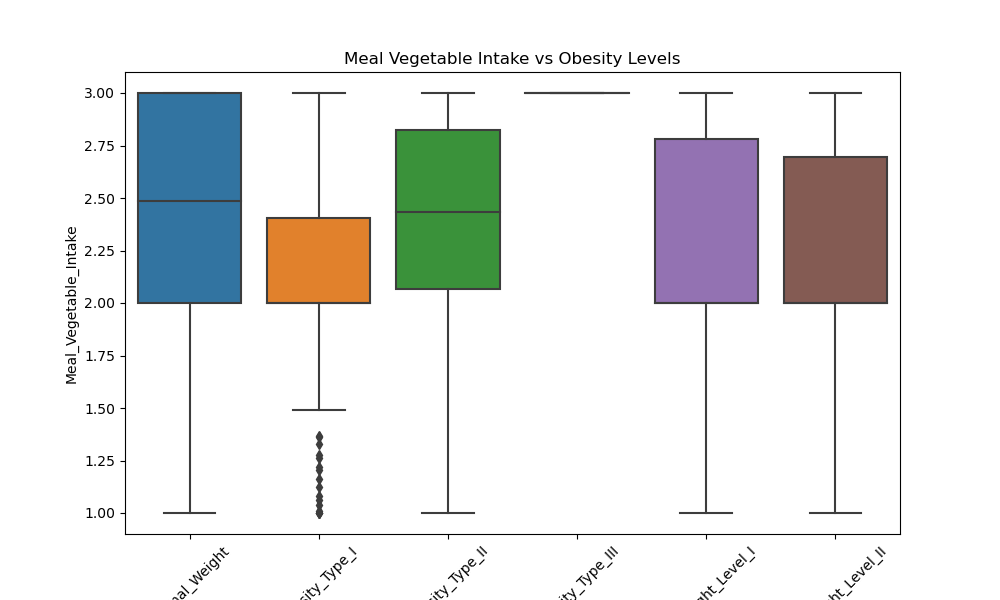

**Sunera Athukorala**

**Steph Adey**

**Laura Liu**

**John Robertson**

# Predicting Obesity Levels Based on Lifestyle Factors
This project aims to predict obesity levels among individuals based on various lifestyle and physical factors. By analyzing the relationship between these factors and obesity levels, we aim to provide insights that can help in the prevention and management of obesity. The dataset used in this project includes attributes related to eating habits, physical activity, and other lifestyle factors.

## Project Overview

This project aims to predict obesity levels among individuals based on various lifestyle and physical factors. By analysing the relationship between these factors and obesity levels, we aim to provide insights that can help in the prevention and management of obesity. The dataset used in this project includes attributes related to eating habits, physical activity, and other lifestyle factors.

=======

### Locate the data, clean the data, and build the dataframe
=======
1. To develop predictive models that accurately classify individuals into different obesity levels based on their lifestyle and physical characteristics. 
2. We aim to investigate the correlation between various factors (variables) and the target variable (obesity) to understand their relationships and impacts.
3. Our goal is to develop a predictive model through machine learning that can accurately estimate the likelihood of obesity based on these factors. 
4. By evaluating and refining our model, we strive to enhance its accuracy in predicting obesity levels from input variables, ultimately aiming for a robust and reliable predictive tool.

## Objectives

1.  Develop predictive models to classify individuals into different obesity levels.
2.  Investigate the correlation between various factors and obesity to understand their relationships and impacts.
3.  Develop a machine learning model to estimate the likelihood of obesity based on these factors.
4.  Refine the model to enhance its accuracy in predicting obesity levels.

## Data Description

The dataset includes features such as gender, age, height, weight, family history with overweight, high-caloric food consumption, vegetable consumption, number of main meals, food consumption between meals, smoking habits, daily water intake, monitoring of calorie intake, frequency of physical activity, screen time, alcohol consumption, mode of transportation, and obesity level.

An initial data analysis has been conducted to measure how the features are represented against the obesity targets.

Omitting the physical factors (BMI, height & weight) we get a general overview on the impact of each feature on the weight categorisation

The features based on their weight classification have been summarised through the use of box and whisker plots:

## Data Sources

-   Data sourced from the UC Irvine Machine Learning Repository:  Obesity Levels Dataset.

## Modeling Techniques

1.  **Neural Networks**

Neural Network modelling was used to categorise individuals as either normal or overweight/obese, then to further distinguish between overweight/obese. The model uses all the feature data to predict the target.

  Two models were created:

  * With BMI, Height & Weight
  * Without BMI, Height & Weight

BMI, Height & Weight all skew the model to greater than 99% accuracy. Given these are features directly related to health and not lifestyle it was decided to run a parallel model without these features.

The neural network model was optimised by altering several elements:

  * Number of hidden layers
  * Number of neurons
  * Activation function

The most effective model was the one which returned the highest accuracy while minimising the loss. The top models were configured as below:

---

**Obese/Overweight or Not**

|***With BMI, Height, Weight***|***Without BMI, Height, Weight***|
|---|---|
| **Hidden Layers:** 3| **Hidden Layers:** 2 |
| **Neurons:** 30 | **Neurons:** 25|
| **Activation Function:** selu | **Activation Function:** selu|
| **Accuracy:** 99.4% | **Accuracy:** 91.8%|
---

**Obese or Overweight**

|***With BMI, Height, Weight***|***Without BMI, Height, Weight***|
|---|---|
|**Hidden Layers:** 2|**Hidden Layers:** 2|
|**Neurons:** 30|**Neurons:** 35|
|**Activation Function:** selu|**Activation Function:** relu|
|**Accuracy:** 99.7%|**Accuracy:** 88.9%|

The Neural Network models used in tandem are able to accurately predict the health status, overweight or obese, to an accuracy of 81%. Based entirely off non-invasive lifestyle factors this is considered an incredibly accurate result.

2.  **Logistic Regression**

3.  **Support Vector Machine (SVM)**

Support Vector Machine (SVM) modelling was used to categorise individuals as either normal or overweight/obese, then to further distinguish between overweight/obese. The model uses all the feature data to predict the target.

Two models were created:

* With BMI, Height & Weight
* Without BMI, Height & Weight

BMI, Height & Weight all skew the model to greater than 98% accuracy. Given these are features directly related to health and not lifestyle it was decided to run a parallel model without these features.

The SVM model was optimized by altering several elements:

* Kernel function (linear, polynomial, RBF)
* Regularization parameter (C)
* Gamma parameter (for non-linear kernels)

The most effective model was the one which returned the highest accuracy while minimizing the loss. The top models were configured as below:

**Obese/Overweight or Not**

|***With BMI, Height, Weight***|***Without BMI, Height, Weight***|
|---|---|
|**Kernel**: linear	|**Kernel**: linear
|**C**: 1.0	|**C**: 1.0
|**Gamma**: scale	|**Gamma**: scale
|**Accuracy**: 99.5%	|**Accuracy** : 73.2%

**Obese or Overweight**

|***With BMI, Height, Weight***|***Without BMI, Height, Weight***|
|---|---|
|**Kernel**: linear	|**Kernel**: RBF
|**C**: 1.0	|**C**: 1.0
|**Gamma**: scale	|**Gamma**: auto
|**Accuracy**: 99.6%	|**Accuracy** : 73.3%

The SVM models demonstrate high accuracy in predicting obesity status. Even without BMI, Height, and Weight, the models provide valuable insights based on lifestyle factors, achieving up to 73.3% accuracy. These results underscore the importance of both health-related and lifestyle features in predicting obesity

## Data Processing and Feature Engineering

-   Data cleaning, normalisation, and standardisation are performed to prepare the dataset for analysis.
-   Binary and categorical data are converted to numerical form.
-   New features, such as BMI, are created to enhance the model's predictive power.
-   The data is analysed to match expected categorical values, and necessary conversions are applied for consistency.

## Model Training and Evaluation

-   Various machine learning models are trained using the processed data.
-   Model performance is evaluated, and results are interpreted to understand feature importance.
-   Iterative optimisation and evaluation processes are documented to refine model performance.

## How to Run the Project

### Prerequisites

-   Python 3.x
-   Jupyter Notebook
-   An independent library from the UC Irvine Machine Learning, `pip install ucimlrepo`
-   Required Python libraries: pandas, numpy, scikit-learn, matplotlib, seaborn, sqlalchemy

### Setup Instructions

1.  Clone the repository:  `git clone https://github.com/Sueraaa/proj-4-grp-1.git`
2.  Navigate to the project directory:  `cd proj-4-grp-1`
3.  Install the required libraries
4.  Open the Jupyter Notebooks to view and run the code.

### Running the Model

Run  `COMPLETE_modelling_analysis.ipynb`  to load, initialise, train, evaluate, and optimise the model. Data is read through pyspark from an S3 bucket. A .csv file `ObesityDataSet_raw_and_data_synthetic` which is the entire dataset has been included in the `data` directory for ease of access.

Data type information is read directly from the UC Irvine Machine Learning Repository using the `fetch_repo` command from the ucimlrepo library. This dataset has the id 544. A .csv file `database_dtype` has been included in the `data` directory for ease of access.

Processed data has been stored in the variable `processed_feature_data`

Models have been output to the `model_comparison` directory in .csv format. This includes modelling with and without BMI, height & weight.

An additional file `all_model_top_comparisons.csv` has been included in the same directory which identifies top performing models by accuracy for each modelling technique.

Feature analysis visualisations have been out to the `Images` directory in .png format. An additional file `top_model_comparisons.png` has been included which compares the top performing models for each modelling technique.

## Conclusion

Through model optimisation we’ve been able to produce a model which is accurate in predicting obesity to 81% accuracy. Based purely on lifestyle  parameters this has the potential to greatly increase access for those in need of assistance in managing their weight and weight related co-morbidities. The ease of access of the questionnaire and the non-invasive nature of the questions means we're able to produce a more accurate snapshot of peoples weight condition.

## References
- itertools — Functions creating iterators for efficient looping. (n.d.). Python Documentation. https://docs.python.org/3/library/itertools.html
- GridSearch — 3.2. Tuning the hyper-parameters of an estimator — scikit-learn 1.5.0 documentation

